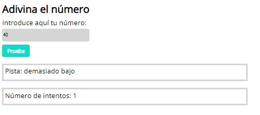

# **RandomNumber**

Half Module 2 Exercise of the Adalab Digital Frontend Development Bootcamp.

This is an app to guess a random number developed with `HTML5` , `CSS3` and `JavaScript`.

## **Installation**

Clone repository and open project on a browser with VSCode live server plugin.

Project **[URL](https://anaguerraabaroa.github.io/RandomNumber/)** is also available on GitHub Pages.

## **Development technologies**

- [**`HTML5`**](https://html.spec.whatwg.org/)
- [**`CSS3`**](https://www.w3.org/Style/CSS/)
- [**`JavaScript`**](https://www.ecma-international.org/ecma-262/)

## **Exercise development requirements**

- Generate a random number with methods Math.random and Math.ceil when app runs
- Input to enter a random number manually
- Button to send manual random number to app
- Inputs for clues and attemps to guess random number. Clues help user to find if manual random number matchs with generated random number

## **Folder Structure**

```
RandomNumber
├── images
│   └── app.jpg
├── styles
│   └── main.css
├── index.html
├── main.js
└── README.md
```

## **Listeners and functions**

### **Get random number**

- **Get initial random number:** function getRandomNumber(max)

### **Get user random number**

- **Event listener:** buttonElement.addEventListener("click", getFinalNumber)
- **Handle user random number and paint clues and attempts:** function getFinalNumber()

### **Get attempts to guess random number**

- **Handle attempts to guess random number:** function getAttemptsNumber()

## **Deployment**

```
git add -A
git commit -m "Message commit"
git push
```

## **Result**


